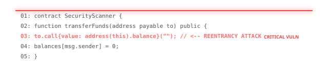

<!-- Header Block -->
<div align="center">
  <br />
  
  
  <p>
    This project was engineered to deliver premium AI auditing without the massive API costs typically associated with LLM applications.
  </p>
</div>

<hr style="border: 0; height: 1px; background-image: linear-gradient(to right, rgba(239, 68, 68, 0), rgba(239, 68, 68, 0.4), rgba(239, 68, 68, 0));" />

<!-- Cyber Audit Scanner Visual (Pure HTML/CSS SVG) -->
<div align="center">
  <h3>🛡️ Active Static Audit Scanner</h3>
  <br />
  
</div>

<br />

---


* **LLM Engine**: Runs locally via **[Ollama](https://ollama.com/)** (`qwen2.5-coder` or `llama3`) for absolute zero cost and total privacy. Falls back to **Groq**'s generous free tier for cloud inference if local hardware is insufficient.
* **Database**: Powered by **[Supabase](https://supabase.com/)**'s free tier (PostgreSQL), providing a robust cloud database without hosting fees. Includes a local SQLite fallback for complete offline capability.
* **Backend**: **FastAPI**, designed to be deployed for free on platforms like Render or Railway.
* **Frontend**: **React + Vite** with Tailwind CSS v4, optimized for static hosting on Vercel or Netlify.

---

## 🎨 UI/UX Aesthetic

We rejected standard, generic SaaS templates in favor of a curated, high-contrast visual experience:
* **Minimal Cyberpunk**: Deep, clinical off-black backgrounds (`#09090b` void).
* **Glassmorphism**: Semi-transparent dark cards with backdrop blurs and subtle 1px borders.
* **Pinterest Masonry**: Results are displayed in a staggered, dynamic masonry grid rather than a boring vertical table.
* **Neon Semantics**: High-contrast, glowing accents dictate severity (e.g., glowing electric red for 'Critical', neon amber for 'Medium').

---

## 🚀 Quick Start Guide

### 1. Backend Setup (FastAPI)
```bash
cd backend
python3 -m venv venv
source venv/bin/activate  # Windows: venv\Scripts\activate
pip install -r requirements.txt

# Copy environment template
cp .env.example .env
```

### 2. Configure Zero-Cost LLM (Ollama)
Download and install [Ollama](https://ollama.com/), then pull the required model in a separate terminal:
```bash
ollama pull qwen2.5-coder
```
*The FastAPI backend will automatically detect Ollama running on `http://localhost:11434`.*

### 3. Start Backend Server
```bash
python main.py
```
*Server runs at `http://localhost:8000` (API docs at `/docs`)*

### 4. Frontend Setup (React/Vite)
Open a new terminal window:
```bash
cd frontend
npm install
npm run dev
```
*Frontend runs at `http://localhost:5173`*

---

## 🗄️ Supabase SQL Schema

If you choose to use the free Supabase tier instead of the local SQLite fallback, run this SQL in your Supabase project's SQL Editor:

```sql
-- Create Audit Jobs Table
CREATE TABLE public.audit_jobs (
    id BIGINT GENERATED BY DEFAULT AS IDENTITY PRIMARY KEY,
    contract_name TEXT DEFAULT 'Unknown',
    contract_code TEXT NOT NULL,
    status TEXT DEFAULT 'processing',
    risk_score INTEGER DEFAULT 0,
    total_vulnerabilities INTEGER DEFAULT 0,
    critical_count INTEGER DEFAULT 0,
    high_count INTEGER DEFAULT 0,
    medium_count INTEGER DEFAULT 0,
    low_count INTEGER DEFAULT 0,
    created_at TIMESTAMP WITH TIME ZONE DEFAULT timezone('utc'::text, now())
);

-- Create Vulnerabilities Table
CREATE TABLE public.vulnerabilities (
    id BIGINT GENERATED BY DEFAULT AS IDENTITY PRIMARY KEY,
    audit_job_id BIGINT REFERENCES public.audit_jobs(id) ON DELETE CASCADE,
    vulnerability_type TEXT,
    severity TEXT,
    line_number INTEGER,
    description TEXT,
    suggested_fix TEXT,
    confidence_score INTEGER DEFAULT 0,
    created_at TIMESTAMP WITH TIME ZONE DEFAULT timezone('utc'::text, now())
);
```

Once executed, add your `SUPABASE_URL` and `SUPABASE_ANON_KEY` to the `backend/.env` file.

---

## 📄 License

MIT License — see [LICENSE](LICENSE) for details.

---

<div align="center" style="margin-top: 40px;">
  
</div>
<p style="font-family: 'Sora', sans-serif; font-size: 13px; font-weight: 600; color: #ef4444; margin: 0; text-align: center;">
  built by ANUJ with ❤️ to the raw frequencies of kendrick lamar's 'HUMBLE.'
</p>
